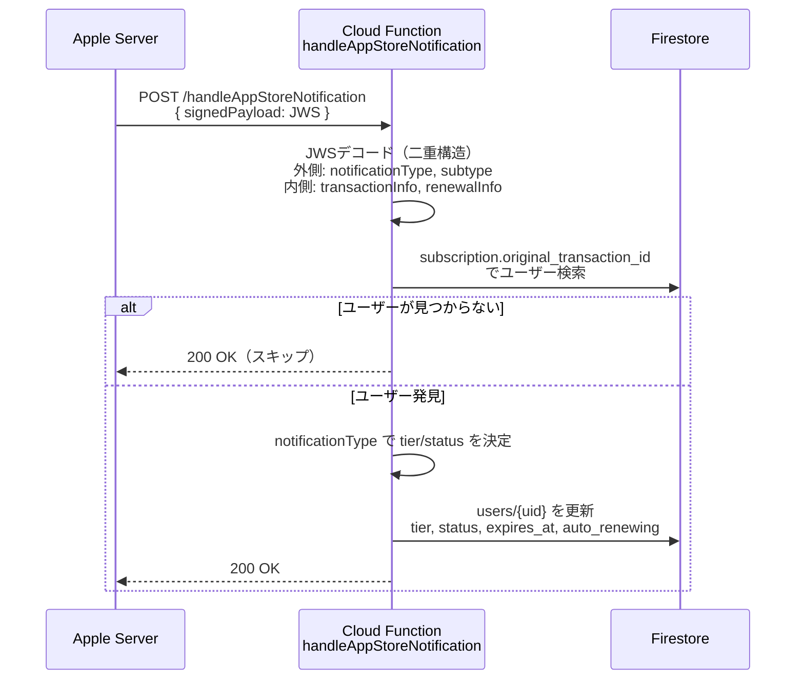

# App Store Server Notifications フロー

Apple からのサーバー間通知を受信し、サブスクリプション状態を自動更新する仕組み。

## 概要

初回購入後のライフサイクル（更新・解約・失効）は Apple が非同期で通知してくる。
`handleAppStoreNotification` Cloud Function がこれを受け取り Firestore を更新する。

> 初回購入フローは `docs/subscription_flow.md` を参照。

## シーケンス図



## 通知タイプと Firestore 更新値

| notificationType | subtype | tier | status |
|-----------------|---------|------|--------|
| `SUBSCRIBED` | — | premium | active |
| `DID_RENEW` | — | premium | active |
| `DID_CHANGE_RENEWAL_INFO` | — | premium | active |
| `DID_CHANGE_RENEWAL_STATUS` | — (autoRenewStatus=1) | premium | active |
| `DID_CHANGE_RENEWAL_STATUS` | — (autoRenewStatus=0) | premium | canceled |
| `DID_FAIL_TO_RENEW` | `GRACE_PERIOD` | premium | grace_period |
| `DID_FAIL_TO_RENEW` | その他 | free | expired |
| `GRACE_PERIOD_EXPIRED` | — | free | expired |
| `EXPIRED` | — | free | expired |
| `REVOKE` | — | free | expired |

## Firestore 更新フィールド

```
users/{uid}
├── tier                   "premium" | "free"
├── remaining_sentences    5 (premium) | 1 (free)
├── remaining_quizzes      10 (premium) | 2 (free)
└── subscription
    ├── status             "active" | "canceled" | "expired" | "grace_period"
    ├── expires_at         Timestamp | null
    ├── auto_renewing      true | false
    └── updated_at         serverTimestamp
```

## JWS ペイロード構造（二重構造）

```
signedPayload (JWS)
└── notificationType, subtype
└── data
    ├── signedTransactionInfo (JWS)
    │   └── originalTransactionId, transactionId, expiresDate, revocationDate
    └── signedRenewalInfo (JWS, optional)
        └── autoRenewStatus, expirationIntent
```

デコードは `parseNotificationPayload()` (`services/appStoreServer.ts`) が担当。

## 重要な設計判断

**Apple は 200 レスポンスを期待する**
処理エラーでも 200 を返す。200 以外を返すと Apple がリトライし、重複処理が発生する。

**署名検証は未実装（TODO）**
現在は JWS のペイロード部分をデコードするのみ。本番環境では Apple Root CA による証明書チェーン検証を追加すべき。

**ユーザー検索キー**
`subscription.original_transaction_id` で検索。`verifySubscription` 実行時に保存される。初回購入前の通知は該当ユーザーなしとして 200 でスキップ。

## 関連ファイル

| ファイル | 役割 |
|---------|------|
| `functions/javascript/src/handleAppStoreNotification.ts` | Cloud Function 本体 |
| `functions/javascript/src/services/appStoreServer.ts` | JWS デコード (`parseNotificationPayload`) |
| `functions/javascript/src/constants/quota.ts` | tier 別クォータ定数 |
| `docs/subscription_flow.md` | 初回購入フロー |
