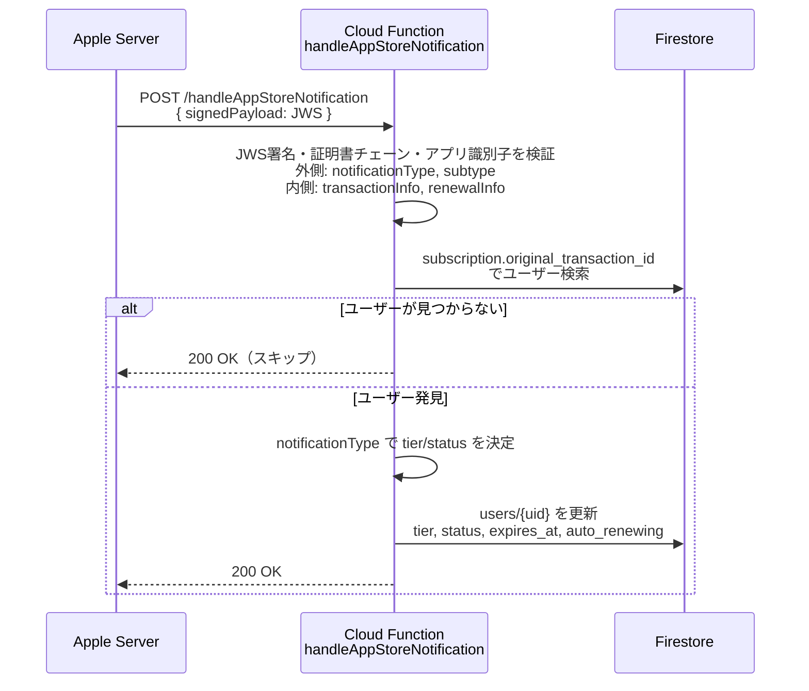

# App Store Server Notifications フロー

Apple からのサーバー間通知を受信し、サブスクリプション状態を自動更新する仕組み。

## 概要

初回購入後のライフサイクル（更新・解約・失効）は Apple が非同期で通知してくる。
`handleAppStoreNotification` Cloud Function がこれを受け取り Firestore を更新する。

> 初回購入フローは `docs/subscription_flow.md` を参照。

## シーケンス図



## 通知タイプと Firestore 更新値

| notificationType | subtype | tier | status |
|-----------------|---------|------|--------|
| `SUBSCRIBED` | — | premium | active |
| `DID_RENEW` | — | premium | active |
| `DID_CHANGE_RENEWAL_INFO` | — | premium | active |
| `DID_CHANGE_RENEWAL_STATUS` | — (autoRenewStatus=1) | premium | active |
| `DID_CHANGE_RENEWAL_STATUS` | — (autoRenewStatus=0) | premium | canceled |
| `DID_FAIL_TO_RENEW` | `GRACE_PERIOD` | premium | grace_period |
| `DID_FAIL_TO_RENEW` | その他 | free | expired |
| `GRACE_PERIOD_EXPIRED` | — | free | expired |
| `EXPIRED` | — | free | expired |
| `REVOKE` | — | free | expired |

## Firestore 更新フィールド

```
users/{uid}
├── tier                   "premium" | "free"
├── remaining_sentences    5 (premium) | 1 (free)
├── remaining_quizzes      10 (premium) | 2 (free)
└── subscription
    ├── status             "active" | "canceled" | "expired" | "grace_period"
    ├── expires_at         Timestamp | null
    ├── auto_renewing      true | false
    └── updated_at         serverTimestamp
```

## JWS ペイロード構造（二重構造）

```
signedPayload (JWS)
└── notificationType, subtype
└── data
    ├── signedTransactionInfo (JWS)
    │   └── originalTransactionId, transactionId, expiresDate, revocationDate
    └── signedRenewalInfo (JWS, optional)
        └── autoRenewStatus, expirationIntent
```

デコードは `parseNotificationPayload()` (`services/appStoreServer.ts`) が担当。

## 重要な設計判断

**再試行できるエラーだけ 5xx にする**
署名不正・アプリ識別子不一致など再試行しても直らない入力は 200 で破棄する。
Firestore 等の一時障害は 5xx を返し、Apple に再送させる。
「通知が正当かどうか判断できない」場合も 5xx にする。200 で捨てると Apple は
再送しないため、設定漏れ（`GCLOUD_PROJECT` 欠落で販売商品を特定できない等）が
そのまま課金状態の永久ズレになる。

**署名とアプリ識別子を検証する**
ES256署名、Apple Root CA G3への証明書パス、有効期限・CA制約を検証する。
さらに `bundleId`、`environment`、任意設定の `appAppleId` を自アプリの値と照合する。
`APP_STORE_BUNDLE_ID` は未設定時 `com.thaimemo.thaiMemo`、
`APP_STORE_APP_APPLE_ID` は数値を指定する。
environment は Production・Sandbox の両方を受け付ける（本番でも審査・TestFlight の
Sandbox 購入が届く）。外側と transactionInfo の一致は必須。
`APP_STORE_ENVIRONMENT` は `verifySubscription` がどちらの Apple ホストを先に
叩くかのヒントであって、通知の環境を絞る設定ではない。

**ユーザー検索キー**
`subscription.original_transaction_id` で検索。`verifySubscription` 実行時に保存される。初回購入前の通知は該当ユーザーなしとして 200 でスキップ。

## 関連ファイル

| ファイル | 役割 |
|---------|------|
| `functions/go/handle_app_store_notification.go` | Cloud Function 本体 |
| `functions/go/internal/appstore/` | 通知とトランザクションのデコード |
| `functions/go/internal/applejws/` | JWS署名検証 |
| `functions/go/internal/quota/quota.go` | tier 別クォータ定数 |
| `docs/subscription_flow.md` | 初回購入フロー |
