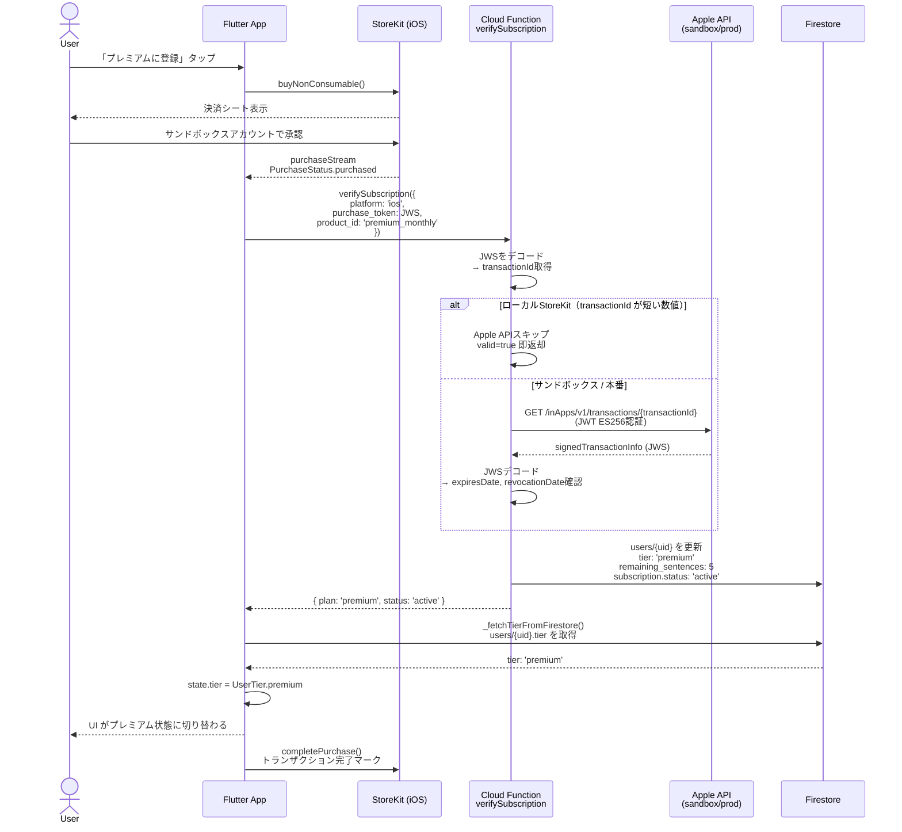

# サブスクリプション登録フロー（iOS）

## シーケンス図



## 環境別の Apple API 分岐（CF内部）

```
purchase_token (JWS: eyJ...) を受信
        │
        ▼
   JWSデコード → transactionId 取得
        │
        ├─ 短い数値ID (1〜10桁) かつ非本番環境
        │         └─→ Apple API スキップ → valid=true（30日後期限）
        │
        └─ それ以外
                  ├─ APP_STORE_ENVIRONMENT = production
                  │         └─→ api.storekit.apple.com
                  └─ それ以外 (sandbox)
                            └─→ api.storekit-sandbox.apple.com
```

## 関連ファイル

| ファイル | 役割 |
|---------|------|
| `lib/services/purchase_service.dart` | 購入フロー・purchaseStream監視 |
| `lib/presentation/providers/subscription_provider.dart` | 状態管理（SubscriptionController） |
| `functions/javascript/src/verifySubscription.ts` | Cloud Function本体 |
| `functions/javascript/src/services/appStoreServer.ts` | Apple API検証・JWSデコード |
| `functions/javascript/src/handleAppStoreNotification.ts` | Apple Server Notifications V2 ハンドラ（更新・解約・失効） → `docs/appstore_notification_flow.md` |
